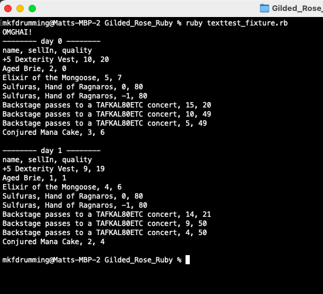
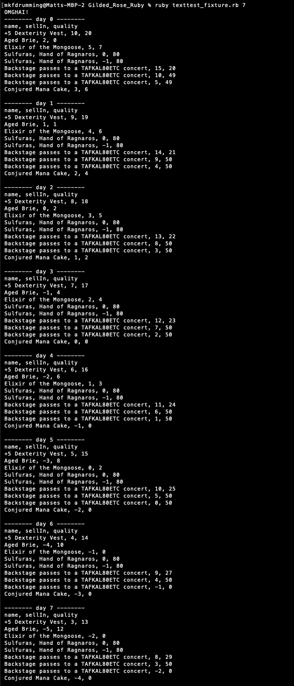

# Gilded Rose Kata (Ruby)

This is my solution to the Gilded Rose Kata developed by Terry Hughes. The code (translated into several languages, I chose to do it in ruby) can be found on [this repo](https://github.com/makersacademy/course/blob/main/individual_challenges/gilded_rose.md) which also includes the [requirements](https://github.com/emilybache/GildedRose-Refactoring-Kata/blob/main/GildedRoseRequirements.txt).

My Approach to this was to write tests first. After that I checked the linting (I used rubocop) and I managed to drastically clean up the code from that. I then started extracting code out into external methods by checking for code that repeats. Lastly I checked that each method only had a single responsibility and extracted out further methods from that. Lastly I implemented the change of conjured items to the code using TDD. I found that because I had written the tests first and made the code easily readable with each method only having a single responsibility, implementing the change was quick and painless.

## Set up

Once you have forked/cloned this repo run:
```
bundle
```

## Running tests
Run:
```
rspec
```

## Running Linting
Run:
```
rubocop
```

## How to use

The file texttest_fixture.rb essentially acts as an example. To run it, run:
```
ruby texttest_fixture.rb
```

By default it will run for 2 days worth of repetitions. I you want to run it for a different number of days you can pass the number of days as an argument. For example to run for 5 days:
```
ruby texttest_fixture.rb 5
```

If you would like to add new items then you have to edit the file before running it, or Create your own, with your own list of items!

## Examples



